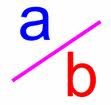

Práctica de Laboratorio #5. Pruebas Unitarias   
================

Introducción
------------

Un número racional es un número con un numerador y un denominador de la forma 

donde `a` es el numerador y `b` es el denominador.  Por ejemplo, `1/3`, `3/4` y `5/2`.

Un número racional no puede tener un cero como denominador, pero si se admite un cero como numerador.

Cada número entero `a` es equivalente al número racional `a/1`.

Los números racionales se utilizan en el cálculo exacto en el que intervienen fracciones. Por ejemplo, `1/3 = 0.33333...` no se puede representar de forma precisa utilizando el formato de punto flotante.  Para obtener resultados exactos, se deben utilizar entonces números racionales.

Los números racionales pueden ser equivalentes, por ejemplo, `1/3 = 2/6 = 3/9 = 4/12`. Por convenio, se utiliza un `1/3` para representar a todos los números racionales que son equivalentes a `1/3`.
El numerador y el denominador de `1/3` sólo tienen como divisor común al número 1, por lo tanto, se dice que `1/3` está reducida a su mínima expresión.

Para reducir un número racional a su mínima expresión, es necesario encontrar el máximo común divisor, de los valores absolutos de su numerador y denominador y dividir ambos por dicho valor.

Para calcular el maximo comun divisor de dos números puede usar el siguiente algoritmo:

        def gcd(n, d):
            n1 = abs(n);
            n2 = abs(d)
            gcd = 1
            k = 1
            while k <= n1 and k <= n2:
                if n1 % k == 0 and n2 % k == 0:
                    gcd = k
                k += 1
            return gcd

1. El fichero `gcd.rb` contiene una implementación en Ruby del máximo
común divisor. Haciendo uso del depurador de ruby detecte el error en el código.

    Para invocar al depurador, se ha de ejecutar: `ruby -rdebug gcd.rb`
    Una vez dentro de mismo:
  * Para pedir ayuda el comando es:

             (rdb:1) help
  * Para listar el programa

                 (rdb:1) l
                 [-4, 5] in gcd.rb
                 => 1  def gcd(u, v)
                    2    u, v = u.abs, v.abs
                    3    while v == 0
                    4      u, v = v, u % v
                    5    end
  * Para ejecutar la siguiente sentencia:

                 (rdb:1) n
  * Para establecer un punto de ruptura (breakpoint):

                 (rdb:1) b 4
  * Para ver dónde se está:

                 (rdb:1) w
2. Implemente una clase Ruby para representar los números racionales.
    Cada objeto debe representar un número racional reducido a su mínima expresión.
    Se han de implementar los métodos de instancia que se solicitan a continuación:
  * `to_s`     # devuelve una cadena con la representación del racional
  * `suma`     # devuelve un nuevo racional que suma al objeto que invoca el que le pasan como parámetro
  * `resta`    # devuelve un nuevo racional que resta al objeto que invoca el que le pasan como parámetro 
  * `producto` # devuelve un nuevo racional que multiplica al objeto que invoca el que le pasan como parámetro
  * `division` # devuelve un nuevo racional que multiplica al objeto que invoca el que le pasan como parámetro

3. Implemente un conjunto de [Pruebas Unitarias](http://en.wikibooks.org/wiki/Ruby_Programming/Unit_testing) que permitan comprobar el correcto funcionamiento 
   de la clase que implementa a los números racionales.
